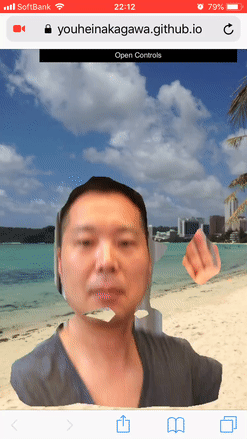

Fake Vacation
====

## Description



This will be a customized [demo of Tensorflow.js](https://github.com/tensorflow/tfjs-models/tree/master/body-pix/demos).
The purpose is to improve our skills.

We realize the part that cuts out someone who was not in the Tensorflow.js demo.

Although it implements it very simply, it may be in demand and it is made public.

The original demo refers to "Body Pix".

これは[Tensorflow.jsのデモ](https://github.com/tensorflow/tfjs-models/tree/master/body-pix/demos)をカスタマイズしたものになります。
目的は当方のスキルアップが目的です。

Tensorflow.jsのデモにはなかった人物を切り抜く部分を実現しています。

非常に簡易的に実装していますが需要があるかもしれないので公開します。

オリジナルのデモは "Body Pix"を参照しています。

## Demo

[Demo](https://youheinakagawa.github.io/fake_vacation/)

## Requirement

I will move with webcam and browser.
maybe.

ウェブカメラとブラウザーがあれば動きます。
たぶん。

## Usage

It is almost same as how to use the original demo.

元のデモの使い方とほぼ同じです。


Install dependencies and prepare the build directory:

```sh
yarn
```

To watch files for changes, and launch a dev server:

```sh
yarn watch
```
